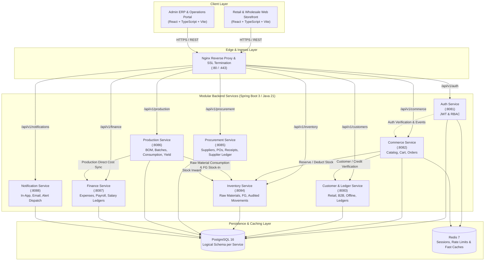

# RR Jaggery Traders — System Architecture Document

## 1. Executive Summary & Vision

**RR Jaggery Traders** is a unified business operating platform engineered to power the end-to-end commercial, manufacturing, inventory, and financial operations of a traditional yet modernizing agro-commodity enterprise. Unlike a generic e-commerce storefront, RR Jaggery Traders reconciles high-volume offline B2B wholesale trade, retail direct-to-consumer sales, cane-to-jaggery batch processing, stock audibility, and granular ledger accounting within a resilient, modular architecture.

The platform balances two core design objectives:
1. **Domain Modularity:** Strict logical boundaries across 8 discrete business domains, ensuring domain isolation, distinct database ownership, and clean separation of concerns.
2. **Pragmatic, Low-Cost Deployment:** Initial deployment footprint designed for a single cost-effective VPS running Docker Compose and reverse-proxied by Nginx, without the cost and operational overhead of prematurely introduced Kubernetes clusters or managed multi-cloud infrastructure.

---

## 2. High-Level Architecture Diagram

---

## 3. Key Architectural Pillars

### 3.1 Strict Domain and Database Ownership
- Every service owns its logical schema and table boundaries.
- **No direct cross-service table joins or updates.** Services exchange data strictly via synchronous REST APIs (with resilient timeout/retry patterns) or asynchronous event pub-sub.
- In the initial single-VPS deployment, services reside in a single PostgreSQL instance across isolated schemas (`auth_schema`, `commerce_schema`, `customer_schema`, etc.) or prefixed tables. This permits seamless extraction to discrete RDS/managed databases when traffic warrants.

### 3.2 Immutability of Financial & Inventory Mutations
- **Inventory Changes:** The system prohibits direct updates like `UPDATE products SET stock = stock - 5`. Every inventory shift requires an immutable `StockMovement` row stating transaction type, reference document ID, batch/lot ID, source location, and delta. Current balances are continuously verified and locked during transactions.
- **Ledger Entries:** Double-entry-inspired ledger accounting. Every invoice, payment, refund, or discount creates an immutable debit/credit row. Customer and supplier balances are derived and maintained via database transactions with strict balance validation.
- **Floating Point Prohibition:** All monetary fields, tax amounts, percentages, quantities, yields, and rates are strictly modeled using `java.math.BigDecimal` (mapped to PostgreSQL `NUMERIC(15,2)` or `NUMERIC(12,4)`).

### 3.3 Three-Tier Customer Taxonomy
The system architecturally supports three distinct customer types:
1. **Retail Customer:** Self-registered, web account, retail catalog pricing, digital checkout.
2. **Registered Wholesale Customer:** Self-registered or admin-onboarded, GSTIN, wholesale pricing tiers, minimum order quantities (MOQs), assigned credit limit and credit days.
3. **Offline / Unregistered Wholesale Customer:** **No digital credentials or web login.** Fully managed by staff via the Admin ERP. Capable of receiving offline orders, printed invoices, credit terms, and ledger tracking with partial/cash payments.

### 3.4 Traceable Batch Production
- Cane to jaggery processing operates on a batch lifecycle (`PLANNED` $\rightarrow$ `MATERIALS_READY` $\rightarrow$ `IN_PRODUCTION` $\rightarrow$ `QUALITY_CHECK` $\rightarrow$ `COMPLETED`).
- Recipes/BOMs define standard input ratios (sugarcane, clarifying lime/herbal agents, bagasse/firewood fuel, packaging).
- Actual raw material consumption is tracked against batch yields. Wastage, moisture loss, and scrap are recorded to compute exact Cost-per-Kilogram (Cost/KG).

---

## 4. Technology Stack Matrix

| Layer | Selection | Version / Rationale |
| :--- | :--- | :--- |
| **Backend Language** | Java | **Java 21 LTS** (Virtual Threads, Records, Pattern Matching) |
| **Backend Framework** | Spring Boot | **3.3+** (Spring Security 6, Spring Data JPA, Hibernate 6) |
| **API Protocol** | REST / JSON | OpenAPI 3.0 / Swagger UI for contract documentation |
| **Frontend Framework** | React + TypeScript | **React 18+**, Vite build tool, strictly typed TypeScript |
| **Frontend Styling** | Tailwind CSS | Utility-first responsive design, modern dark/light styling |
| **Database** | PostgreSQL | **PostgreSQL 16** (ACID compliance, schema isolation) |
| **Cache & Session** | Redis | **Redis 7** (Token denylist, session storage, rate limiting) |
| **Reverse Proxy** | Nginx | Reverse proxy, static asset delivery, SSL/TLS termination |
| **Containerization** | Docker | Multi-stage Dockerfiles, Docker Compose orchestration |
| **CI / CD** | GitHub Actions | Automated build, test, Docker image validation, PR gates |
| **Infrastructure** | Low-Cost VPS | Linux (Ubuntu 24.04 LTS), 4-8 GB RAM, automated cron backups |

---

## 5. Security & Authentication Architecture
- Stateless JWT-based authentication issued by `Auth Service`.
- Asymmetric (RS256) or secured HMAC-SHA256 signature verification across downstream services.
- Fine-grained Role-Based Access Control (`ROLE_CUSTOMER`, `ROLE_ADMIN`, `ROLE_PRODUCTION_MANAGER`, `ROLE_INVENTORY_STAFF`, `ROLE_FINANCE`).
- API Gateway/Reverse Proxy rate limiting and input validation filters to protect against denial-of-service and injection vulnerabilities.
