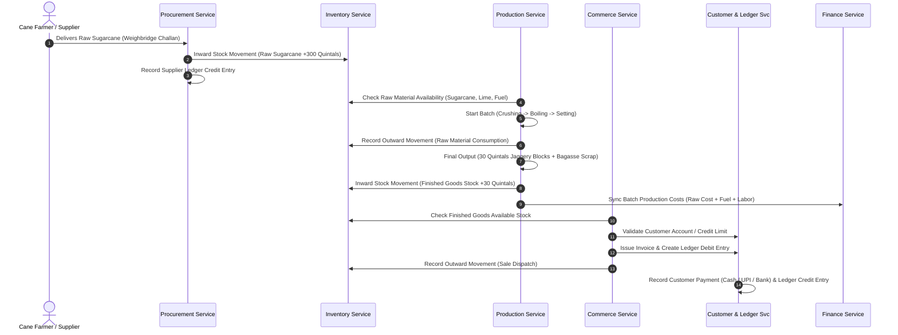
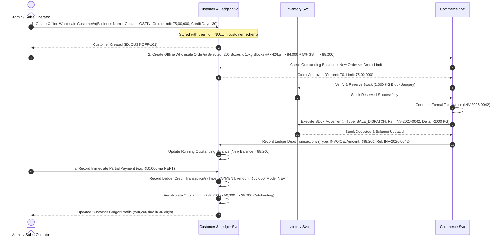
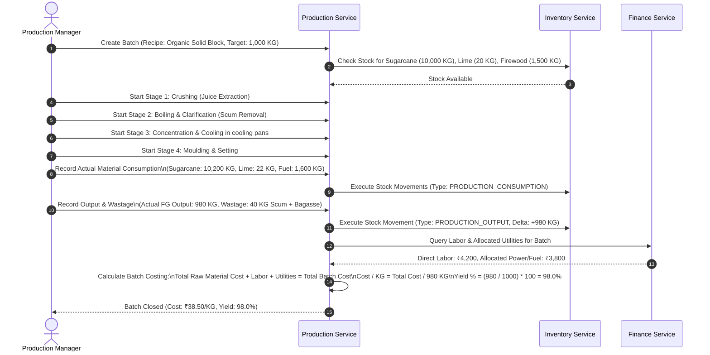
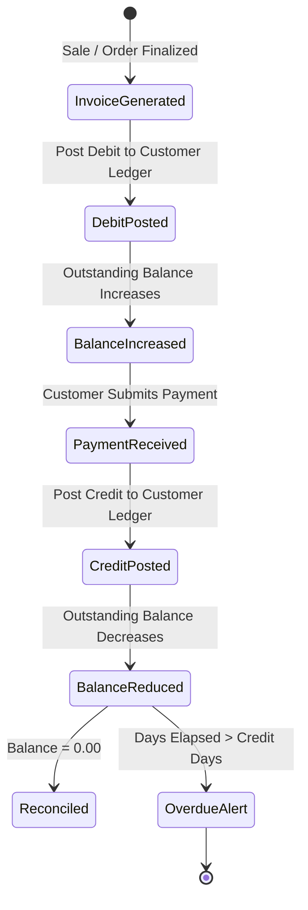

# RR Jaggery Traders — Core Business Data Flows

## 1. End-to-End Supply-to-Sale Data Flow

The lifecycle connects agricultural procurement, production transformations, finished goods stocking, and commercial fulfillment.

---

## 2. Offline / Unregistered Wholesale Flow (Critical Business Workflow)

This workflow serves wholesale traders who order directly via phone, dispatch desk, or in-person at the manufacturing facility without having a website user account.

---

## 3. Batch Production & Costing Flow

The production process transforms agricultural feedstock into packaged jaggery while capturing cost variances.

---

## 4. Financial Ledger Audit Flow

