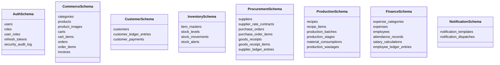

# RR Jaggery Traders — Database Ownership & Data Segregation Policy

## 1. Core Principle: Isolated Logical Schemas

In accordance with architectural principles, all 8 logical services currently share a single PostgreSQL 16 cluster to conserve infrastructure costs on a low-cost VPS. However, **services are strictly decoupled at the schema level**.

Under no circumstances may Service A perform SQL queries (`SELECT`, `INSERT`, `UPDATE`, `DELETE`) or joins against tables owned by Service B.

---

## 2. PostgreSQL Schema Allocation

| Schema Name | Owning Service | Allowed Readers / Writers |
| :--- | :--- | :--- |
| `auth_schema` | `auth-service` | Exclusive to `auth-service` |
| `commerce_schema` | `commerce-service` | Exclusive to `commerce-service` |
| `customer_schema` | `customer-ledger-service`| Exclusive to `customer-ledger-service` |
| `inventory_schema` | `inventory-service` | Exclusive to `inventory-service` |
| `procurement_schema`| `procurement-service` | Exclusive to `procurement-service` |
| `production_schema` | `production-service` | Exclusive to `production-service` |
| `finance_schema` | `finance-service` | Exclusive to `finance-service` |
| `notification_schema`| `notification-service` | Exclusive to `notification-service` |

---

## 3. Database Ownership Matrix

---

## 4. Cross-Domain Integrity Rules

1. **Foreign Key Constraints Across Schemas are Prohibited:**
   - E.g., `commerce_schema.orders.customer_id` is stored as a raw UUID; it does not declare a foreign key constraint referencing `customer_schema.customers(id)`.
   - Data referential integrity is guaranteed by application-level validation and saga/transaction handlers.
2. **Schema Separation by User Roles in PostgreSQL:**
   - In production, each service connects via its own PostgreSQL database role (e.g., `rr_commerce_user`, `rr_inventory_user`), granting `USAGE` and `ALL PRIVILEGES` only on its assigned schema.
3. **Migration Management:**
   - Each service maintains its own version-controlled migration scripts via Flyway (e.g., `src/main/resources/db/migration/V1__init.sql`).
   - Tables are created with schema-qualified names or configured with `search_path` set specifically to the service's schema.
   - Hibernate `ddl-auto` is strictly set to `validate` in production and `none` in CI.
4. **Independent Extractability:**
   - If `commerce-service` or `inventory-service` experiences high load in future phases, its schema can be moved to an isolated AWS RDS / DigitalOcean Managed Database instance by updating a single connection URL, requiring zero domain rewrites.
