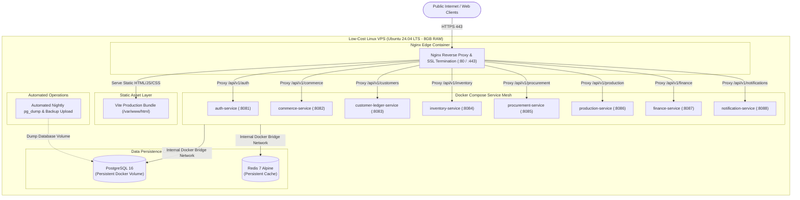

# RR Jaggery Traders — Deployment Architecture & DevOps Plan

## 1. Low-Cost Infrastructure Topology

The production and staging environments are architected to operate cost-effectively on a single virtual private server (e.g., Hetzner, DigitalOcean, or AWS Lightsail with 4 vCPUs and 8GB RAM at ~$20–$40/month), avoiding excessive multi-cloud managed service overhead.



---

## 2. Container Resource Allocation & Memory Optimization

To guarantee reliable operation on a single 8GB host, all JVM containers utilize aggressive memory limits:

| Container | Base Image | JVM Memory Limit | Host CPU Limit |
| :--- | :--- | :--- | :--- |
| `postgres` | `postgres:16-alpine` | 1.5 GB Shared Buffers | 1.5 vCPU |
| `redis` | `redis:7-alpine` | 256 MB maxmemory | 0.5 vCPU |
| `auth-service` | `eclipse-temurin:21-jre-alpine` | 384 MB (`-Xmx384m`) | 0.5 vCPU |
| `commerce-service` | `eclipse-temurin:21-jre-alpine` | 512 MB (`-Xmx512m`) | 0.5 vCPU |
| `customer-ledger-service`| `eclipse-temurin:21-jre-alpine` | 384 MB (`-Xmx384m`) | 0.5 vCPU |
| `inventory-service` | `eclipse-temurin:21-jre-alpine` | 384 MB (`-Xmx384m`) | 0.5 vCPU |
| `procurement-service`| `eclipse-temurin:21-jre-alpine` | 384 MB (`-Xmx384m`) | 0.5 vCPU |
| `production-service` | `eclipse-temurin:21-jre-alpine` | 384 MB (`-Xmx384m`) | 0.5 vCPU |
| `finance-service` | `eclipse-temurin:21-jre-alpine` | 384 MB (`-Xmx384m`) | 0.5 vCPU |
| `notification-service` | `eclipse-temurin:21-jre-alpine` | 256 MB (`-Xmx256m`) | 0.5 vCPU |
| `nginx-gateway` | `nginx:alpine` | 128 MB | 0.5 vCPU |
| **Total Headroom** | — | **~5.1 GB Total Allocated** | **Buffer of 2.9 GB Free for OS / Disk Buffers** |

---

## 3. Persistent Volumes & Data Safety

The Docker Compose configuration enforces distinct named volumes mapped to host storage:
- `postgres_data`: `/var/lib/postgresql/data` (PostgreSQL data files)
- `redis_data`: `/data` (Redis RDB snapshot storage)
- `receipt_uploads`: Shared volume for invoice PDFs and expense receipts.

### Automated Backup Script (`infrastructure/scripts/backup.sh`)
- Nightly execution via host cron:
  ```bash
  #!/usr/bin/env bash
  set -eo pipefail
  TIMESTAMP=$(date +%Y%m%d_%H%M%S)
  BACKUP_FILE="/backups/rr_jaggery_db_${TIMESTAMP}.sql.gz"
  docker exec -t rr-postgres pg_dumpall -U postgres | gzip > "$BACKUP_FILE"
  # Keep 14 days locally; stream to S3/Cloudflare R2 storage
  find /backups -name "*.sql.gz" -mtime +14 -exec rm {} \;
  ```

---

## 4. Reverse Proxy & SSL Configuration (`nginx/nginx.conf`)
- HTTP (Port 80) automatically redirects to HTTPS (Port 443).
- Free automated TLS certificates managed via Let's Encrypt / Certbot.
- Gzip compression enabled for JS, CSS, and SVG assets.
- Upstream routing configured using Docker internal DNS (`http://auth-service:8081`, etc.).
