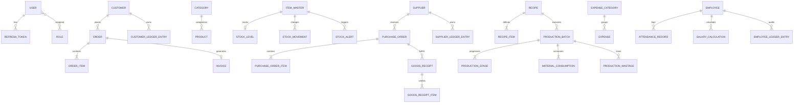

# RR Jaggery Traders — Domain Model & ERD

## 1. Domain Entities & Relationships Overview

The RR Jaggery domain models the full physical journey from cane procurement, chemical-free processing, and packaging to wholesale ledger management, retail orders, and financial accounting.

---

## 2. Granular Data Schema Definitions

### 2.1 Identity & Security (`auth_schema`)

#### `users`
- `id`: `UUID PRIMARY KEY`
- `email`: `VARCHAR(255) UNIQUE NOT NULL`
- `phone`: `VARCHAR(20) UNIQUE`
- `password_hash`: `VARCHAR(255) NOT NULL`
- `full_name`: `VARCHAR(150) NOT NULL`
- `status`: `VARCHAR(30) NOT NULL` (`ACTIVE`, `SUSPENDED`, `LOCKED`)
- `failed_attempts`: `INT DEFAULT 0`
- `created_at`: `TIMESTAMP WITH TIME ZONE NOT NULL`
- `updated_at`: `TIMESTAMP WITH TIME ZONE NOT NULL`

#### `roles` & `user_roles`
- `role_id`: `UUID PRIMARY KEY`
- `name`: `VARCHAR(50) UNIQUE NOT NULL` (`ROLE_ADMIN`, `ROLE_CUSTOMER`, `ROLE_PRODUCTION_MANAGER`, `ROLE_INVENTORY_STAFF`, `ROLE_FINANCE`)
- `user_roles`: `(user_id, role_id) PRIMARY KEY`

---

### 2.2 Customer & Ledger Domain (`customer_schema`)

#### `customers`
- `id`: `UUID PRIMARY KEY`
- `user_id`: `UUID NULL` (Populated if registered retail/wholesale online customer; `NULL` for offline wholesale)
- `customer_type`: `VARCHAR(40) NOT NULL` (`RETAIL`, `REGISTERED_WHOLESALE`, `OFFLINE_WHOLESALE`)
- `business_name`: `VARCHAR(200)`
- `contact_person`: `VARCHAR(150) NOT NULL`
- `email`: `VARCHAR(255)`
- `phone`: `VARCHAR(20) NOT NULL`
- `gstin`: `VARCHAR(15)`
- `pan`: `VARCHAR(10)`
- `billing_address`: `JSONB NOT NULL` (street, city, state, pincode)
- `shipping_address`: `JSONB NOT NULL`
- `credit_limit`: `NUMERIC(15,2) DEFAULT 0.00`
- `credit_days`: `INT DEFAULT 0`
- `current_outstanding`: `NUMERIC(15,2) DEFAULT 0.00`
- `status`: `VARCHAR(30) NOT NULL` (`ACTIVE`, `INACTIVE`, `BLACKLISTED`)
- `created_at`: `TIMESTAMP WITH TIME ZONE NOT NULL`
- `updated_at`: `TIMESTAMP WITH TIME ZONE NOT NULL`

#### `customer_ledger_entries`
- `id`: `UUID PRIMARY KEY`
- `customer_id`: `UUID NOT NULL REFERENCES customers(id)`
- `entry_date`: `TIMESTAMP WITH TIME ZONE NOT NULL`
- `transaction_type`: `VARCHAR(40) NOT NULL` (`INVOICE`, `PAYMENT`, `CREDIT_NOTE`, `DEBIT_NOTE`, `OPENING_BALANCE`)
- `reference_type`: `VARCHAR(50) NOT NULL` (`COMMERCE_ORDER`, `OFFLINE_SALE`, `DIRECT_PAYMENT`, `RETURN`)
- `reference_id`: `VARCHAR(100) NOT NULL` (e.g., Invoice # or Payment Transaction #)
- `debit_amount`: `NUMERIC(15,2) NOT NULL DEFAULT 0.00` (Increases customer liability / owed amount)
- `credit_amount`: `NUMERIC(15,2) NOT NULL DEFAULT 0.00` (Reduces customer liability / payment made)
- `running_balance`: `NUMERIC(15,2) NOT NULL` (Calculated outstanding balance after this entry)
- `payment_mode`: `VARCHAR(30)` (`CASH`, `UPI`, `NEFT_RTGS`, `CHEQUE`, `CREDIT_MEMO`)
- `notes`: `TEXT`
- `created_by`: `UUID NOT NULL`
- `created_at`: `TIMESTAMP WITH TIME ZONE NOT NULL`

---

### 2.3 Product Catalog & Orders (`commerce_schema`)

#### `products`
- `id`: `UUID PRIMARY KEY`
- `category_id`: `UUID NOT NULL`
- `item_code`: `VARCHAR(50) UNIQUE NOT NULL` (Links conceptually to Inventory Item)
- `sku`: `VARCHAR(50) UNIQUE NOT NULL`
- `name`: `VARCHAR(200) NOT NULL`
- `slug`: `VARCHAR(250) UNIQUE NOT NULL`
- `description`: `TEXT`
- `grade`: `VARCHAR(50)` (`ORGANIC_GRADE_A`, `TRADITIONAL_YELLOW`, `DARK_UNREFINED`)
- `form`: `VARCHAR(50)` (`SOLID_BLOCK`, `POWDER`, `CUBES`, `LIQUID_JONNI`)
- `package_weight_kg`: `NUMERIC(10,3) NOT NULL`
- `retail_price`: `NUMERIC(15,2) NOT NULL`
- `wholesale_price`: `NUMERIC(15,2) NOT NULL`
- `min_wholesale_quantity`: `INT NOT NULL DEFAULT 10`
- `gst_rate`: `NUMERIC(5,2) NOT NULL DEFAULT 5.00`
- `active`: `BOOLEAN DEFAULT TRUE`

#### `orders` & `order_items`
- `orders.id`: `UUID PRIMARY KEY`
- `orders.order_number`: `VARCHAR(50) UNIQUE NOT NULL`
- `orders.customer_id`: `UUID NOT NULL`
- `orders.customer_type`: `VARCHAR(40) NOT NULL`
- `orders.subtotal_amount`: `NUMERIC(15,2) NOT NULL`
- `orders.tax_amount`: `NUMERIC(15,2) NOT NULL`
- `orders.discount_amount`: `NUMERIC(15,2) DEFAULT 0.00`
- `orders.net_total`: `NUMERIC(15,2) NOT NULL`
- `orders.status`: `VARCHAR(40) NOT NULL` (`PENDING`, `CONFIRMED`, `PROCESSING`, `SHIPPED`, `DELIVERED`, `CANCELLED`)
- `orders.payment_status`: `VARCHAR(40) NOT NULL` (`UNPAID`, `PARTIALLY_PAID`, `PAID`, `ON_CREDIT`)
- `orders.is_offline_order`: `BOOLEAN DEFAULT FALSE`
- `order_items.id`: `UUID PRIMARY KEY`
- `order_items.order_id`: `UUID NOT NULL REFERENCES orders(id)`
- `order_items.product_id`: `UUID NOT NULL`
- `order_items.quantity`: `NUMERIC(12,3) NOT NULL`
- `order_items.unit_price`: `NUMERIC(15,2) NOT NULL`
- `order_items.tax_rate`: `NUMERIC(5,2) NOT NULL`
- `order_items.line_total`: `NUMERIC(15,2) NOT NULL`

---

### 2.4 Inventory & Movements (`inventory_schema`)

#### `item_masters`
- `id`: `UUID PRIMARY KEY`
- `item_code`: `VARCHAR(50) UNIQUE NOT NULL`
- `item_name`: `VARCHAR(200) NOT NULL`
- `item_type`: `VARCHAR(40) NOT NULL` (`RAW_MATERIAL`, `FINISHED_GOODS`, `PACKAGING`, `CONSUMABLE`)
- `uom`: `VARCHAR(20) NOT NULL` (`KG`, `QUINTAL`, `LITRE`, `PIECE`, `BAG`)
- `min_threshold_qty`: `NUMERIC(12,3) NOT NULL DEFAULT 0.000`
- `reorder_qty`: `NUMERIC(12,3) NOT NULL DEFAULT 0.000`

#### `stock_levels`
- `id`: `UUID PRIMARY KEY`
- `item_id`: `UUID NOT NULL REFERENCES item_masters(id)`
- `warehouse_code`: `VARCHAR(50) NOT NULL DEFAULT 'DEFAULT_WH'`
- `quantity_on_hand`: `NUMERIC(14,3) NOT NULL DEFAULT 0.000`
- `quantity_reserved`: `NUMERIC(14,3) NOT NULL DEFAULT 0.000`
- `quantity_available`: `NUMERIC(14,3) NOT NULL DEFAULT 0.000`
- `last_movement_at`: `TIMESTAMP WITH TIME ZONE NOT NULL`

#### `stock_movements` (Strictly Auditable & Append-Only)
- `id`: `UUID PRIMARY KEY`
- `movement_number`: `VARCHAR(50) UNIQUE NOT NULL`
- `item_id`: `UUID NOT NULL REFERENCES item_masters(id)`
- `movement_type`: `VARCHAR(50) NOT NULL` (`PURCHASE_RECEIPT`, `SALE_DISPATCH`, `PRODUCTION_CONSUMPTION`, `PRODUCTION_OUTPUT`, `DAMAGE_WASTAGE`, `PHYSICAL_AUDIT_ADJUSTMENT`)
- `reference_type`: `VARCHAR(50) NOT NULL` (`PO_RECEIPT`, `ORDER_FULFILLMENT`, `PROD_BATCH`, `MANUAL_AUDIT`)
- `reference_id`: `VARCHAR(100) NOT NULL`
- `quantity_delta`: `NUMERIC(14,3) NOT NULL` (Positive for stock-in, negative for stock-out)
- `balance_after`: `NUMERIC(14,3) NOT NULL`
- `unit_valuation`: `NUMERIC(15,2)`
- `reason`: `TEXT`
- `created_by`: `UUID NOT NULL`
- `created_at`: `TIMESTAMP WITH TIME ZONE NOT NULL`

---

### 2.5 Production & Batch Processing (`production_schema`)

#### `recipes` & `recipe_items`
- `recipe.id`: `UUID PRIMARY KEY`
- `recipe.code`: `VARCHAR(50) UNIQUE NOT NULL`
- `recipe.name`: `VARCHAR(200) NOT NULL`
- `recipe.target_finished_item_id`: `UUID NOT NULL`
- `recipe.standard_output_kg`: `NUMERIC(12,3) NOT NULL`
- `recipe_items.recipe_id`: `UUID NOT NULL REFERENCES recipes(id)`
- `recipe_items.raw_item_id`: `UUID NOT NULL`
- `recipe_items.standard_qty_required`: `NUMERIC(12,3) NOT NULL`
- `recipe_items.waste_tolerance_pct`: `NUMERIC(5,2) DEFAULT 0.00`

#### `production_batches`
- `id`: `UUID PRIMARY KEY`
- `batch_number`: `VARCHAR(50) UNIQUE NOT NULL`
- `recipe_id`: `UUID NOT NULL REFERENCES recipes(id)`
- `finished_item_id`: `UUID NOT NULL`
- `status`: `VARCHAR(40) NOT NULL` (`PLANNED`, `MATERIALS_READY`, `IN_PRODUCTION`, `QUALITY_CHECK`, `COMPLETED`, `CANCELLED`)
- `planned_quantity_kg`: `NUMERIC(12,3) NOT NULL`
- `actual_output_kg`: `NUMERIC(12,3) DEFAULT 0.000`
- `yield_percentage`: `NUMERIC(6,2)` (Calculated as `(actual_output_kg / planned_quantity_kg) * 100`)
- `total_material_cost`: `NUMERIC(15,2) DEFAULT 0.00`
- `allocated_expense_cost`: `NUMERIC(15,2) DEFAULT 0.00`
- `total_production_cost`: `NUMERIC(15,2) DEFAULT 0.00`
- `cost_per_kg`: `NUMERIC(12,4) DEFAULT 0.0000`
- `start_time`: `TIMESTAMP WITH TIME ZONE`
- `completion_time`: `TIMESTAMP WITH TIME ZONE`
- `notes`: `TEXT`

---

### 2.6 Finance & Payroll (`finance_schema`)

#### `expenses`
- `id`: `UUID PRIMARY KEY`
- `expense_number`: `VARCHAR(50) UNIQUE NOT NULL`
- `category_id`: `UUID NOT NULL`
- `amount`: `NUMERIC(15,2) NOT NULL`
- `expense_date`: `DATE NOT NULL`
- `payee_name`: `VARCHAR(200) NOT NULL`
- `payment_mode`: `VARCHAR(30) NOT NULL` (`CASH`, `BANK_TRANSFER`, `UPI`, `CHEQUE`)
- `production_batch_id`: `UUID NULL` (If directly allocated to a specific batch)
- `description`: `TEXT`
- `receipt_url`: `VARCHAR(500)`

#### `employees` & `employee_ledger_entries`
- `employee.id`: `UUID PRIMARY KEY`
- `employee.code`: `VARCHAR(50) UNIQUE NOT NULL`
- `employee.full_name`: `VARCHAR(150) NOT NULL`
- `employee.salary_type`: `VARCHAR(40) NOT NULL` (`MONTHLY`, `DAILY`, `PER_KG_PRODUCED`, `CONTRACT`)
- `employee.base_rate`: `NUMERIC(15,2) NOT NULL`
- `employee_ledger_entries.id`: `UUID PRIMARY KEY`
- `employee_ledger_entries.employee_id`: `UUID NOT NULL REFERENCES employees(id)`
- `employee_ledger_entries.entry_date`: `DATE NOT NULL`
- `employee_ledger_entries.transaction_type`: `VARCHAR(40) NOT NULL` (`SALARY_CREDIT`, `ADVANCE_DEBIT`, `PAYMENT_DISBURSAL`, `DEDUCTION`)
- `employee_ledger_entries.debit_amount`: `NUMERIC(15,2) NOT NULL DEFAULT 0.00`
- `employee_ledger_entries.credit_amount`: `NUMERIC(15,2) NOT NULL DEFAULT 0.00`
- `employee_ledger_entries.running_balance`: `NUMERIC(15,2) NOT NULL`
