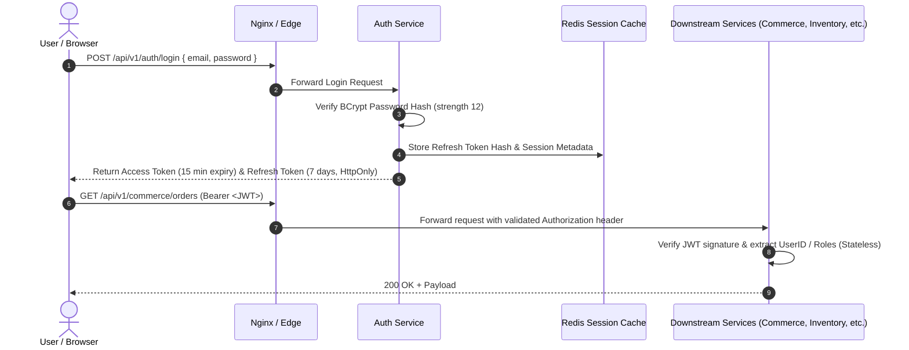

# RR Jaggery Traders — Security Model & Threat Mitigation

> **Last Updated:** Pre-Sprint 6 Business Access Model Revision
> **Authoritative Roles:** `ADMIN` · `MANAGER` · `CUSTOMER`

---

## 1. Authentication & Session Strategy

The platform employs a stateless JSON Web Token (JWT) architecture with stateful revocation capabilities via Redis.



---

## 2. Authoritative Portal Roles

The application enforces **exactly three** portal login roles. All legacy internal operational roles (`PRODUCTION_MANAGER`, `EMPLOYEE`, `INVENTORY_STAFF`, `FINANCE`, `REGISTERED_WHOLESALE`) have been removed as login roles.

### 2.1 Role Definitions

| Role | Authority String | Description |
| :--- | :--- | :--- |
| `ADMIN` | `ROLE_ADMIN` | Business Owner / General Manager. Full platform access including user management, master data, executive dashboard, and all operational modules. |
| `MANAGER` | `ROLE_MANAGER` | Operations Supervisor. Full access to Procurement, Inventory, Production, Customer/Wholesale Ledger, and Offline Orders. No access to User Management or Master Configuration. |
| `CUSTOMER` | `ROLE_CUSTOMER` | Retail Customer. Access strictly limited to the customer-facing storefront: product browsing, cart, self-placed orders, and self-profile. |

### 2.2 RBAC Access Matrix

| Module | `ADMIN` | `MANAGER` | `CUSTOMER` |
| :--- | :---: | :---: | :---: |
| Customer Storefront | ✅ Full | ✅ Full | ✅ Self only |
| Procurement | ✅ Full | ✅ Full | ❌ Denied |
| Inventory | ✅ Full | ✅ Full | ❌ Denied |
| Production | ✅ Full | ✅ Full | ❌ Denied |
| Customer/Wholesale Ledger | ✅ Full | ✅ Full | ❌ Denied |
| Offline Orders | ✅ Full | ✅ Full | ❌ Denied |
| Executive Dashboard | ✅ Full | ❌ Denied | ❌ Denied |
| User Management | ✅ Full | ❌ Denied | ❌ Denied |
| Master Configuration | ✅ Full | ❌ Denied | ❌ Denied |

### 2.3 Seeded Default Accounts

| Email | Role | Purpose |
| :--- | :--- | :--- |
| `admin@rrjaggery.com` | `ADMIN` | Platform owner / general manager |
| `manager@rrjaggery.com` | `MANAGER` | Default operations supervisor |
| `retail@example.com` | `CUSTOMER` | Sample retail customer |

### 2.4 Non-Login Business Records

The following entity types are **business records only** and carry **no portal login**:

- **Wholesale Customers** — Stored in `customer_schema.customers` with `customer_type = 'WHOLESALE'`. All historical records, GSTIN, credit terms, MOQ, ledger entries, and manager-entered orders are preserved. Managed internally by ADMIN/MANAGER.
- **Employees** — Internal workforce records. All operational tasks are performed by MANAGER-role accounts. No separate employee portal login exists.

---

## 3. Threat Mitigation & Defensive Engineering

### 3.1 Credential & Secret Management
- **Zero Secrets in Source Control:** Passwords, database credentials, JWT secret keys, and encryption keys are strictly supplied via environment variables (`.env`).
- **Development vs. Production Isolation:** Development configurations provide non-sensitive defaults (`postgres/postgres`), whereas production mandates robust secrets provided via Docker secrets or secure host environment files.

### 3.2 Password Hashing
- Stored using **BCrypt** with an adaptive work factor of `12`.
- Account lockout policy: 5 consecutive failed attempts trigger a 15-minute temporary lockout to thwart brute-force password guessing.

### 3.3 Data Injection & Tampering
- **SQL Injection Prevention:** 100% parameterization via Spring Data JPA and Hibernate Query Language (HQL). Native SQL queries are prohibited unless using strict parameter binding.
- **Cross-Site Scripting (XSS):** React automatically escapes HTML content in JSX expressions. Incoming payloads are scrubbed of HTML tags via centralized Jackson/Hibernate validators.
- **CORS Configuration:** Explicit origin whitelisting in Spring Security. Wildcard `*` origins are strictly forbidden in production configurations.

### 3.4 Financial & Inventory Integrity Controls
- All mutations to customer ledger balances, supplier balances, and stock inventory occur within ACID database transactions (`@Transactional(isolation = Isolation.READ_COMMITTED)`).
- Idempotency keys (`X-Idempotency-Key` HTTP header) are required for offline order submissions and payment disbursements to prevent duplicate billing.

### 3.5 Security Audit Logging
Sensitive operations (privilege escalation, manual ledger adjustments, production batch cancellations, Manager account lifecycle changes) emit immutable audit records to `auth_schema.security_audit_log`:

```sql
CREATE TABLE security_audit_log (
    id UUID PRIMARY KEY,
    user_id UUID,
    action_type VARCHAR(100) NOT NULL,
    entity_type VARCHAR(100) NOT NULL,
    entity_id VARCHAR(100) NOT NULL,
    old_state JSONB,
    new_state JSONB,
    client_ip VARCHAR(45) NOT NULL,
    user_agent TEXT,
    timestamp TIMESTAMP WITH TIME ZONE NOT NULL
);
```

---

## 4. Role Migration History

| Legacy Role | Pre-Revision Status | Post-Revision Status |
| :--- | :--- | :--- |
| `PRODUCTION_MANAGER` | Portal login role | **Removed.** Migrated to `MANAGER`. |
| `EMPLOYEE` | Portal login role | **Removed.** Accounts disabled; operations via `MANAGER`. |
| `INVENTORY_STAFF` | Portal login role | **Removed.** Absorbed into `MANAGER`. |
| `FINANCE` | Portal login role | **Removed.** Will be addressed in Sprint 6 Finance module under `ADMIN`/`MANAGER` access. |
| `REGISTERED_WHOLESALE` | Portal login role for wholesale customers | **Removed.** Wholesale customers are business records only; no portal login. |
