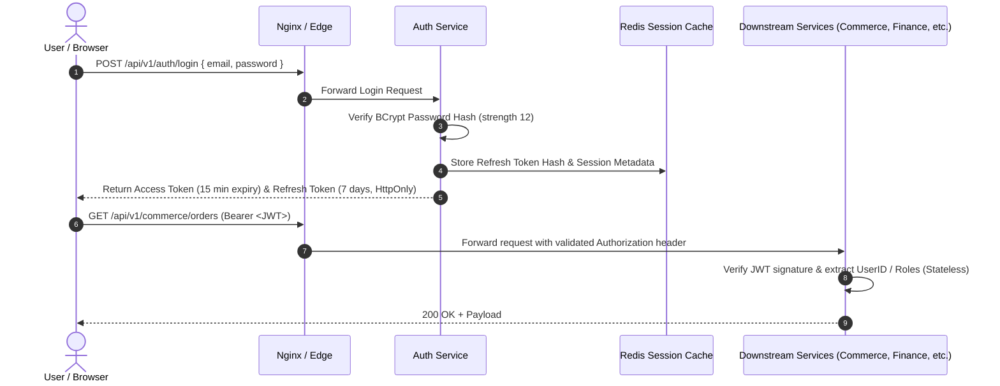

# RR Jaggery Traders — Security Model & Threat Mitigation

## 1. Authentication & Session Strategy

The platform employs a stateless JSON Web Token (JWT) architecture with stateful revocation capabilities via Redis.



---

## 2. Role-Based Access Control (RBAC) Matrix

| Role | Description | Storefront | Admin ERP | Production | Inventory | Finance |
| :--- | :--- | :---: | :---: | :---: | :---: | :---: |
| `ROLE_CUSTOMER` | Self-registered retail/wholesale user | Read/Write (Self) | Denied | Denied | Denied | Denied |
| `ROLE_ADMIN` | Business Owner / General Manager | Full Access | Full Access | Full Access | Full Access | Full Access |
| `ROLE_PRODUCTION_MANAGER` | Plant & Manufacturing Supervisor | Denied | Restricted | Full Access | Read/Consume | Read Costs |
| `ROLE_INVENTORY_STAFF` | Warehouse & Gatekeeper | Denied | Restricted | Denied | Full Access | Denied |
| `ROLE_FINANCE` | Accountant / Payroll Manager | Denied | View Only | Read Costs | Denied | Full Access |

---

## 3. Threat Mitigation & Defensive Engineering

### 3.1 Credential & Secret Management
- **Zero Secrets in Source Control:** Passwords, database credentials, JWT secret keys, and encryption keys are strictly supplied via environment variables (`.env`).
- **Development vs. Production Isolation:** Development configurations provide non-sensitive defaults (`postgres/postgres`), whereas production mandates robust secrets provided via Docker secrets or secure host environment files.

### 3.2 Password Hashing
- Stored using **BCrypt** with an adaptive work factor of `12`.
- Account lockout policy: 5 consecutive failed attempts trigger a 15-minute temporary lockout to thwart brute-force password guessing.

### 3.3 Data Injection & Tampering
- **SQL Injection Prevention:** 100% parameterization via Spring Data JPA and Hibernate Query Language (HQL). Native SQL queries are prohibited unless using strict parameter binding.
- **Cross-Site Scripting (XSS):** React automatically escapes HTML content in JSX expressions. Incoming payloads are scrubbed of HTML tags via centralized Jackson/Hibernate validators.
- **CORS Configuration:** Explicit origin whitelisting in Spring Security. Wildcard `*` origins are strictly forbidden in production configurations.

### 3.4 Financial & Inventory Integrity Controls
- All mutations to customer ledger balances, supplier balances, and stock inventory occur within ACID database transactions (`@Transactional(isolation = Isolation.READ_COMMITTED)`).
- Idempotency keys (`X-Idempotency-Key` HTTP header) are required for offline order submissions and payment disbursements to prevent duplicate billing.

### 3.5 Security Audit Logging
Sensitive operations (privilege escalation, manual ledger adjustments, production batch cancellations, employee wage modifications) emit immutable audit records to `auth_schema.security_audit_log`:
```sql
CREATE TABLE security_audit_log (
    id UUID PRIMARY KEY,
    user_id UUID,
    action_type VARCHAR(100) NOT NULL,
    entity_type VARCHAR(100) NOT NULL,
    entity_id VARCHAR(100) NOT NULL,
    old_state JSONB,
    new_state JSONB,
    client_ip VARCHAR(45) NOT NULL,
    user_agent TEXT,
    timestamp TIMESTAMP WITH TIME ZONE NOT NULL
);
```
