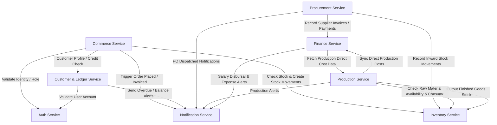

# RR Jaggery Traders — Service Boundaries & Responsibilities

This document formalizes the domain boundaries and responsibilities across the 8 core services of the RR Jaggery Traders enterprise platform.

---

## Service Dependency Matrix

---

## 1. Auth Service (`auth-service`)
- **Port:** `8081`
- **Primary Responsibility:** User identity lifecycle, authentication credentials, role assignments, JWT issuance/validation, password reset tokens, and security audits.
- **Owned Entities:**
  - `User` (id, email, phone, passwordHash, status, failedLoginAttempts, createdAt, updatedAt)
  - `Role` (id, name: `ROLE_ADMIN`, `ROLE_CUSTOMER`, `ROLE_PRODUCTION_MANAGER`, `ROLE_INVENTORY_STAFF`, `ROLE_FINANCE`)
  - `UserRole` (userId, roleId)
  - `RefreshToken` (id, tokenHash, userId, expiryDate, revoked)
  - `AuditSecurityLog` (id, userId, action, ipAddress, userAgent, timestamp)
- **Direct Database Ownership:** `auth_schema`
- **External Communications:** Downstream services validate JWT signatures via shared secret or public key; auth service publishes user registration events.

---

## 2. Commerce Service (`commerce-service`)
- **Port:** `8082`
- **Primary Responsibility:** Product catalog, categories, pricing rules (retail vs wholesale MOQs), digital shopping carts, online orders, checkout lifecycle, and invoice generation.
- **Owned Entities:**
  - `Category` (id, name, slug, parentId, displayOrder, active)
  - `Product` (id, categoryId, name, sku, description, grade, form: `BLOCK`/`POWDER`/`CUBES`, unitOfMeasure, retailPrice, wholesalePrice, minWholesaleQty, gstRate, active)
  - `ProductImage` (id, productId, imageUrl, isPrimary, sortOrder)
  - `Cart` / `CartItem` (id, customerId, productId, quantity, addedPrice)
  - `Order` (id, orderNumber, customerId, customerType, totalAmount, taxAmount, discountAmount, netAmount, status: `PENDING`/`CONFIRMED`/`PROCESSING`/`DISPATCHED`/`DELIVERED`/`CANCELLED`, paymentStatus, shippingAddressSnapshot, createdAt)
  - `OrderItem` (id, orderId, productId, productName, sku, unitPrice, quantity, taxRate, taxAmount, totalLineAmount)
  - `Invoice` (id, invoiceNumber, orderId, customerId, invoiceDate, dueDate, subtotal, taxAmount, totalAmount, pdfUrl, status)
- **Direct Database Ownership:** `commerce_schema`
- **Inter-service Interactions:** Calls `customer-ledger-service` to check wholesale customer credit limits; calls `inventory-service` to reserve and decrement stock.

---

## 3. Customer & Ledger Service (`customer-ledger-service`)
- **Port:** `8083`
- **Primary Responsibility:** Unified customer repository spanning Retail, Registered Wholesale, and Offline Wholesale customers; credit term management; customer financial ledger; invoice settlement recording; balance calculations.
- **Owned Entities:**
  - `Customer` (id, userId [optional for offline], customerType: `RETAIL`/`REGISTERED_WHOLESALE`/`OFFLINE_WHOLESALE`, businessName, contactPerson, email, phone, gstin, pan, billingAddress, shippingAddress, creditLimit, creditDays, status)
  - `CustomerLedgerEntry` (id, customerId, entryDate, transactionType: `INVOICE`/`PAYMENT`/`CREDIT_NOTE`/`DEBIT_NOTE`/`ADJUSTMENT`, referenceType: `ORDER`/`OFFLINE_SALE`/`DIRECT_PAYMENT`, referenceId, debitAmount, creditAmount, runningBalance, paymentMode: `CASH`/`UPI`/`BANK_TRANSFER`/`CHEQUE`, notes, createdBy)
  - `CustomerPayment` (id, customerId, paymentNumber, paymentDate, amount, paymentMode, transactionReference, allocationStatus, notes)
- **Direct Database Ownership:** `customer_schema`
- **Key Invariants:**
  - Offline wholesale customers require **no website user credentials**.
  - Customer running balance is strictly updated inside atomic database transactions.
  - Credit limit checks reject orders exceeding allowable limits unless overridden by admin authorization.

---

## 4. Inventory Service (`inventory-service`)
- **Port:** `8084`
- **Primary Responsibility:** Tracking physical quantities of raw materials and finished goods across stock movements; low stock alert generation; batch stock allocations.
- **Owned Entities:**
  - `ItemMaster` (id, itemCode, itemName, itemType: `RAW_MATERIAL`/`FINISHED_GOODS`/`PACKAGING`/`CONSUMABLE`, unitOfMeasure: `KG`/`QUINTAL`/`LITRE`/`PIECE`, minStockThreshold, reorderQuantity)
  - `StockLevel` (id, itemId, warehouseLocation, currentQuantity, reservedQuantity, availableQuantity, updatedAt)
  - `StockMovement` (id, movementNumber, itemId, movementType: `PURCHASE_RECEIPT`/`SALE_DISPATCH`/`PRODUCTION_CONSUMPTION`/`PRODUCTION_OUTPUT`/`DAMAGE_WASTAGE`/`RECONCILIATION_ADJUSTMENT`, referenceType: `PO`/`ORDER`/`BATCH`/`MANUAL`, referenceId, quantityDelta, unitCost, totalValuation, reason, createdBy, createdAt)
  - `StockAlert` (id, itemId, alertType: `LOW_STOCK`/`OUT_OF_STOCK`, thresholdLevel, currentLevel, acknowledged, createdAt)
- **Direct Database Ownership:** `inventory_schema`
- **Key Invariants:**
  - **Zero Direct Updates:** Current quantity is updated only via `StockMovement` processing.
  - Negative available stock is strictly prevented unless explicitly authorized by operational override flags.

---

## 5. Procurement Service (`procurement-service`)
- **Port:** `8085`
- **Primary Responsibility:** Supplier master data, supplier contract rates, Purchase Requisitions (PR), Purchase Orders (PO), Goods Receipt Notes (GRN), supplier invoices, and supplier ledger.
- **Owned Entities:**
  - `Supplier` (id, supplierCode, supplierName, contactPerson, phone, email, address, gstin, paymentTerms, bankDetails, active)
  - `SupplierRateContract` (id, supplierId, itemId, agreedRatePerUnit, effectiveFrom, effectiveTo)
  - `PurchaseOrder` (id, poNumber, supplierId, orderDate, expectedDeliveryDate, totalAmount, status: `DRAFT`/`ISSUED`/`PARTIALLY_RECEIVED`/`COMPLETED`/`CANCELLED`)
  - `PurchaseOrderItem` (id, purchaseOrderId, itemId, orderedQuantity, receivedQuantity, unitPrice, lineTotal)
  - `GoodsReceipt` (id, grnNumber, purchaseOrderId, receiptDate, vehicleNumber, challanNumber, inspectedBy, notes)
  - `GoodsReceiptItem` (id, goodsReceiptId, itemId, receivedQuantity, acceptedQuantity, rejectedQuantity, rejectionReason)
  - `SupplierLedgerEntry` (id, supplierId, entryDate, transactionType: `PURCHASE_INVOICE`/`PAYMENT`/`RETURN`/`DEBIT_NOTE`, referenceId, debitAmount, creditAmount, runningBalance, paymentMode, notes)
- **Direct Database Ownership:** `procurement_schema`
- **Inter-service Interactions:** GRN creation triggers `inventory-service` stock inward movements and `finance-service` supplier invoice entries.

---

## 6. Production Service (`production-service`)
- **Port:** `8086`
- **Primary Responsibility:** Bill of Materials (BOM) / Recipes, production batch planning, stage progression, real-time material consumption, batch output, wastage/loss recording, yield calculation, and batch costing.
- **Owned Entities:**
  - `Recipe` (id, recipeCode, targetFinishedItemId, standardBatchSize, description, active)
  - `RecipeItem` (id, recipeId, rawItemId, standardQuantityRequired, unitOfMeasure, wastageAllowancePercent)
  - `ProductionBatch` (id, batchNumber, recipeId, finishedItemId, targetQuantity, actualQuantity, status: `PLANNED`/`MATERIALS_READY`/`IN_PRODUCTION`/`QUALITY_CHECK`/`COMPLETED`/`CANCELLED`, startDate, completionDate, yieldPercentage, totalCost, unitCostPerKg, notes)
  - `ProductionStage` (id, batchId, stageName: `CRUSHING`/`BOILING_CLARIFICATION`/`CONCENTRATION_COOLING`/`MOULDING_SETTING`/`PACKAGING`, stageOrder, status, startedAt, completedAt, operatorNotes)
  - `MaterialConsumption` (id, batchId, rawItemId, plannedQuantity, actualQuantityConsumed, unitCost, totalCost)
  - `ProductionWastage` (id, batchId, stageId, wastageType: `BAGASSE_SCRAP`/`SCUM_IMPURITIES`/`MOISTURE_EVAPORATION`/`PACKAGING_DEFECT`, quantity, reason)
- **Direct Database Ownership:** `production_schema`
- **Inter-service Interactions:**
  - Verifies raw material availability with `inventory-service`.
  - Decrements raw materials upon consumption and stock-ins finished goods upon batch completion.
  - Passes total production cost & cost-per-KG to `finance-service`.

---

## 7. Finance Service (`finance-service`)
- **Port:** `8087`
- **Primary Responsibility:** Operational expense accounting, expense allocation to production batches, employee master data, daily/shift attendance, salary rate calculation (monthly, daily, per-KG, contract), advances, deductions, salary ledgers, and pay slips.
- **Owned Entities:**
  - `ExpenseCategory` (id, code, name, description, isProductionDirectCost)
  - `Expense` (id, expenseNumber, categoryId, amount, paymentDate, payeeName, paymentMode, referenceNumber, receiptAttachmentUrl, productionBatchId [optional], description, approvedBy)
  - `Employee` (id, employeeCode, fullName, designation, salaryType: `MONTHLY`/`DAILY`/`PER_KG_PRODUCED`/`CONTRACT`, baseRate, bankAccountDetails, active)
  - `AttendanceRecord` (id, employeeId, attendanceDate, status: `PRESENT`/`HALF_DAY`/`ABSENT`/`OVERTIME`, hoursWorked, outputKgProduced [for per-KG pay])
  - `SalaryCalculation` (id, employeeId, periodMonth, periodYear, grossSalary, advanceDeductions, otherDeductions, netPayable, status: `CALCULATED`/`APPROVED`/`DISBURSED`)
  - `EmployeeLedgerEntry` (id, employeeId, entryDate, transactionType: `SALARY_CREDIT`/`ADVANCE_DEBIT`/`PAYMENT_DISBURSAL`/`DEDUCTION`, referenceId, debitAmount, creditAmount, runningBalance, paymentMode, notes)
- **Direct Database Ownership:** `finance_schema`

---

## 8. Notification Service (`notification-service`)
- **Port:** `8088`
- **Primary Responsibility:** Dispatching transactional notifications, SMS/Email receipts, inventory reorder alerts, customer credit limit/overdue warnings, and batch status events.
- **Owned Entities:**
  - `NotificationTemplate` (id, templateCode, channel: `IN_APP`/`EMAIL`/`SMS`/`WHATSAPP`, subjectTemplate, bodyTemplate)
  - `NotificationDispatch` (id, recipientId, recipientEmail, recipientPhone, channel, title, content, status: `QUEUED`/`SENT`/`FAILED`, sentAt, retryCount)
- **Direct Database Ownership:** `notification_schema`
