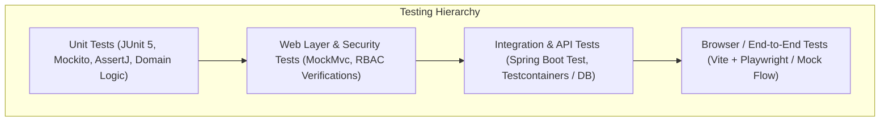

# RR Jaggery Traders — Quality Assurance & Testing Strategy

## 1. Testing Philosophy & Quality Gateways

In accordance with strict project rules:
> *"Testing is part of implementation. A feature is NOT complete just because it compiles."*

No feature will be marked as `Implemented` or `Verified` without passing automated verification across unit, controller, repository, integration, and browser layers.

---

## 2. Test Classification Matrix

| Test Type | Scope | Tools / Libraries | Execution Frequency |
| :--- | :--- | :--- | :--- |
| **Unit Tests** | Pure domain calculations (Yield %, Cost/KG, Ledger running balance, GST amounts) | JUnit 5, AssertJ, Mockito | Local build & Every PR |
| **Controller Tests** | REST contracts, DTO validation errors, HTTP status codes, JSON shapes | `@WebMvcTest`, MockMvc | Local build & Every PR |
| **Repository Tests** | Data persistence, custom queries, optimistic locking, index speed | `@DataJpaTest`, PostgreSQL/H2 | Local build & Every PR |
| **Integration Tests**| Cross-module workflows (PO Receipt -> Stock Increase, Order -> Ledger Debit) | `@SpringBootTest` | Nightly & Pre-release |
| **Security Tests** | RBAC permission boundaries, token expiration, forged signatures, unauthorized access | Spring Security Test | Every PR |
| **E2E / Browser** | Critical flows (Storefront checkout, Offline order entry, Batch completion) | Playwright / Browser Subagent | Sprint Reviews & Releases |

---

## 3. High-Priority Business Test Scenarios

### 3.1 Financial Ledger Integrity Tests
- **Zero-Sum Balance Validation:** `debit_amount` and `credit_amount` must be mutually exclusive and non-negative.
- **Idempotent Payment Application:** Posting the same payment transaction multiple times must reject with duplicate error and leave the running balance unaltered.
- **Overdue Computation:** Invoices with `due_date < current_date` and unpaid balance must immediately flag customer as overdue.

### 3.2 Inventory Movement Audit Tests
- **No Direct Stock Overwrite:** Attempting to update `StockLevel` without an associated `StockMovement` must fail at the service layer.
- **Negative Stock Prevention:** Orders demanding 500 KG when available stock is 400 KG must throw `InsufficientStockException` and rollback all database updates.

### 3.3 Production Batch Calculation Tests
- **Yield Accuracy:** Batch consuming 10,000 KG cane producing 980 KG jaggery must yield exactly `9.80%`.
- **Cost/KG Calculation:** Raw material costs + fuel expenses + labor costs divided by finished output quantity must equal unit cost per KG using 4-decimal precision.

### 3.4 Offline Wholesale Flow Integration Test
- Create customer with `customer_type = OFFLINE_WHOLESALE` (verify `user_id == null`).
- Submit offline order for 100 boxes on credit.
- Verify invoice created, stock movement logged, and customer ledger debited.
- Post partial cash payment; verify running balance decremented correctly.
