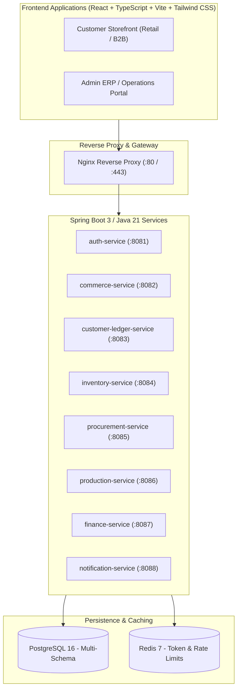
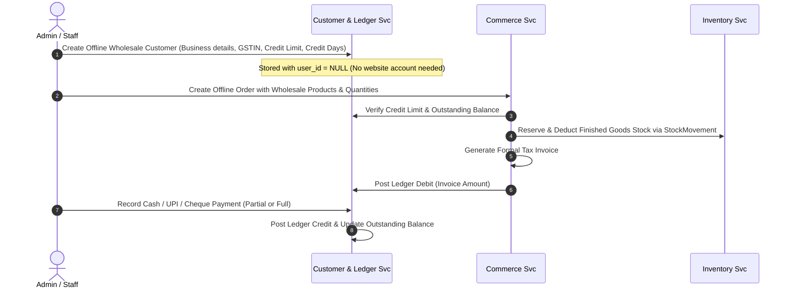
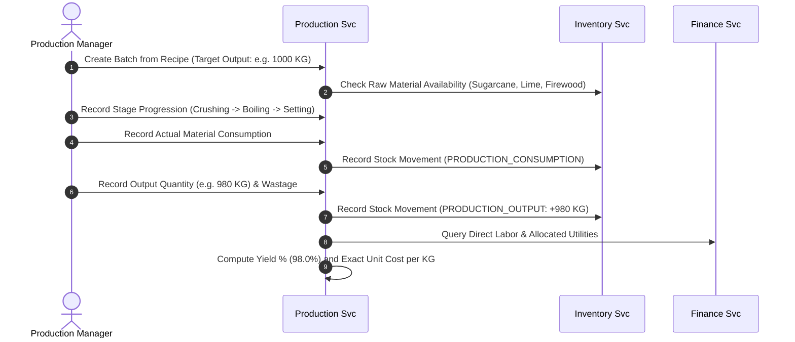

# Implementation Plan — Sprint 0: Foundation & Architecture

RR Jaggery Traders is a unified e-commerce, manufacturing, inventory, wholesale, and financial ledger platform designed for an agro-commodity business. The platform bridges direct-to-consumer digital commerce, phone/desk-based offline wholesale trading, cane-to-jaggery batch processing, and double-entry customer/supplier ledger accounting.

This implementation plan outlines the architecture, service boundaries, database design, repository layout, and the concrete execution plan for **Sprint 0: Foundation**.

---

## 1. System Architecture & High-Level Design

The system is organized into **8 logical services** communicating via REST APIs and sharing a single PostgreSQL 16 instance with strictly isolated schemas. Ingress traffic is routed and SSL-terminated via Nginx, and the entire backend footprint is containerized via Docker Compose to operate within a single cost-effective VPS (4GB–8GB RAM).



---

## 2. Service Boundaries & Database Ownership

| Service Name | Port | Database Schema | Primary Responsibilities |
| :--- | :---: | :---: | :--- |
| **`auth-service`** | 8081 | `auth_schema` | Identity lifecycle, JWT issuance/revocation, RBAC enforcement |
| **`commerce-service`** | 8082 | `commerce_schema` | Product catalog, wholesale/retail pricing, cart, checkout, orders |
| **`customer-ledger-service`**| 8083 | `customer_schema` | Retail, B2B, **offline wholesalers (no web login)**, credit limits, ledgers |
| **`inventory-service`** | 8084 | `inventory_schema` | Raw materials, finished goods, append-only auditable stock movements |
| **`procurement-service`** | 8085 | `procurement_schema` | Cane farmers/suppliers, purchase orders, goods receipts, supplier ledger |
| **`production-service`** | 8086 | `production_schema` | Recipes/BOMs, batch lifecycle, stages, consumption, yield %, cost/KG |
| **`finance-service`** | 8087 | `finance_schema` | Operating expenses, batch cost allocation, employee attendance & payroll |
| **`notification-service`** | 8088 | `notification_schema`| Alerts (low stock, overdue invoices), in-app notifications, emails |

### Critical Architectural Rules
1. **Zero Direct Cross-Schema Joins:** Services access other domain data exclusively through REST APIs.
2. **Immutable Stock Movements:** Inventory is never directly overwritten. Every quantity delta requires a `StockMovement` transaction.
3. **Double-Entry-Style Ledger:** Invoices generate Debits; payments generate Credits. Running balances are transaction-safe.
4. **Strict `BigDecimal`:** Floating-point numbers are prohibited for financial figures, weights, and yields.

---

## 3. Core Business Data Flows

### 3.1 Offline Wholesale Flow (Critical Business Workflow)


### 3.2 Cane-to-Jaggery Production Flow


---

## 4. Key Ambiguities & Technical Risks

- **GST / Inter-state Rules:** Configurable default GST (5%) with tax split (`CGST + SGST` vs `IGST`) depending on shipping destination.
- **Sugarcane Purchase Pricing:** Modeled as contract rate per quintal with adjustment capability at goods weighment.
- **Credit Limit Hard vs Soft Enforcement:** Admin managerial override permitted with mandatory audit log note.
- **Piece-Rate Mill Wages:** Support both individual and batch-shift team pooled rate models.
- **Single-VPS Resource Capping:** JVM heap allocations capped (`-Xmx384m`) across containers to ensure the entire multi-service stack runs stably within an 8GB VPS.

---

## 5. Proposed Repository Structure

```text
RR Jaggery/
├── RR_Jaggery_Traders_Product_Requirements_and_Agile_Sprint_Plan (1).docx
├── docs/
│   ├── architecture.md
│   ├── service-boundaries.md
│   ├── domain-model.md
│   ├── database-ownership.md
│   ├── api-boundaries.md
│   ├── data-flows.md
│   ├── security-model.md
│   ├── technical-decisions.md
│   ├── ambiguities-and-risks.md
│   ├── deployment-architecture.md
│   └── testing-strategy.md
├── frontend/
│   ├── src/
│   │   ├── components/
│   │   ├── layouts/
│   │   ├── pages/
│   │   ├── services/
│   │   ├── App.tsx
│   │   ├── main.tsx
│   │   └── index.css
│   ├── package.json
│   ├── tsconfig.json
│   ├── tailwind.config.js
│   └── vite.config.ts
├── services/
│   ├── common-library/          # Shared DTOs, ApiResponse envelope, ErrorHandling
│   ├── auth-service/            # Port 8081
│   ├── commerce-service/        # Port 8082
│   ├── customer-ledger-service/ # Port 8083
│   ├── inventory-service/       # Port 8084
│   ├── procurement-service/     # Port 8085
│   ├── production-service/      # Port 8086
│   ├── finance-service/         # Port 8087
│   └── notification-service/    # Port 8088
├── infrastructure/
│   ├── docker/
│   │   ├── postgres/
│   │   │   └── init-schemas.sql # Multi-schema initialization
│   │   └── Dockerfile.service   # Multi-stage optimized Spring Boot Dockerfile
│   ├── nginx/
│   │   └── nginx.conf           # Gateway reverse proxy configuration
│   └── scripts/
│       └── backup.sh            # Automated database backup script
├── .github/
│   └── workflows/
│       └── ci.yml               # Automated CI pipeline
├── docker-compose.yml
├── .env.example
├── .gitignore
├── README.md
├── CHANGELOG.md
├── IMPLEMENTATION_STATUS.md
└── TODO-BACKLOG.md
```

---

## 6. Sprint 0 Execution Plan

Once approved, Sprint 0 execution will establish the foundational repository and verified runtime skeleton:

### Step 1: Repository & Git Infrastructure
- Initialize Git repository.
- Configure `.gitignore` for Java/Maven/Gradle, Node.js, and IDE/Docker environments.
- Create `.env.example` with standard development variables.

### Step 2: Frontend Shell Setup
- Initialize React + TypeScript + Vite application in `frontend/`.
- Configure Tailwind CSS with professional typography and theme tokens (warm amber/golden jaggery accents with dark slate neutrals).
- Build shell application with dual layout preview (Storefront navbar vs Admin ERP sidebar) and connection health indicators for all 8 services.
- Verify frontend builds cleanly with `npm run build`.

### Step 3: Backend Services Scaffolding
- Create a multi-module Maven or Gradle structure with Java 21:
  - `services/common-library`: Shared `ApiResponse<T>`, `ErrorResponse`, `GlobalExceptionHandler`, and base audit models.
  - Skeletons for all 8 microservices (`auth-service` through `notification-service`).
- Configure Spring Boot Actuator `/actuator/health` and `/api/v1/{service}/health` endpoints.
- Establish unit and controller test templates for each service.
- Verify backend builds cleanly.

### Step 4: Database & Docker Infrastructure
- Create `infrastructure/docker/postgres/init-schemas.sql` to initialize all 8 isolated schemas (`auth_schema`, `commerce_schema`, etc.).
- Create root `docker-compose.yml` defining PostgreSQL 16, Redis 7, backend service containers, and Nginx proxy.
- Create Nginx configuration in `infrastructure/nginx/nginx.conf`.
- Create database backup script in `infrastructure/scripts/backup.sh`.

### Step 5: CI/CD Pipeline
- Create `.github/workflows/ci.yml` to run automated linting, frontend build, and backend test suites on pull requests.

### Step 6: Verification & Final Sprint 0 Report
- Execute frontend build and test.
- Execute backend service builds and unit tests.
- Validate health check endpoints.
- Update `CHANGELOG.md`, `IMPLEMENTATION_STATUS.md`, and `TODO-BACKLOG.md`.
- Present the verified Sprint 0 evidence report.

---

## 7. Verification Plan

### Automated Verification
- **Frontend Build:** `npm run build` in `frontend/` succeeds with zero TypeScript errors.
- **Backend Build & Tests:** Maven/Gradle build runs across all service modules; unit tests pass.
- **Configuration & Syntax Verification:** Docker Compose and Nginx config linting.

### Manual / Browser Verification
- Verify Vite frontend dev server launches and renders the responsive navigation, storefront shell, ERP shell, and live service health matrix.
- Confirm all architecture documents link correctly.
